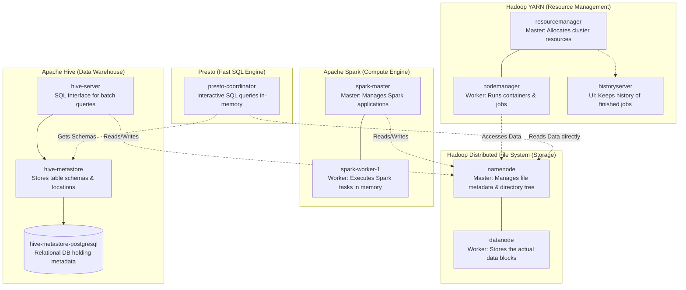

[](https://gitter.im/big-data-europe/Lobby)

# Docker multi-container environment with Hadoop, Spark and Hive

This is it: a Docker multi-container environment with Hadoop (HDFS), Spark and Hive. But without the large memory requirements of a Cloudera sandbox. (On my Windows 10 laptop (with WSL2) it seems to consume a mere 3 GB.)

The only thing lacking, is that Hive server doesn't start automatically. To be added when I understand how to do that in docker-compose.

## Architecture Overview

Here is a visual breakdown of all the containers running in this environment and exactly what their roles are:




## Quick Start

To deploy an the HDFS-Spark-Hive cluster, run:
```
  docker-compose up
```

Hive metastore data is stored in the `hive_metastore_postgresql` named volume, and HDFS data is stored in the Hadoop named volumes. Use `docker-compose down` to stop containers while keeping Hive table metadata and warehouse files. Avoid `docker-compose down -v` unless you intentionally want to delete those volumes.

`docker-compose` creates a docker network that can be found by running `docker network list`, e.g. `docker-hadoop-spark-hive_default`.

Web UIs (how to access)

The Hadoop/Spark services expose several helpful web interfaces. If running Docker on your laptop (Docker Desktop), most interfaces are available via localhost. If using a remote Docker host, substitute <dockerhadoop_IP_address> with the host IP found via `docker network inspect`.

Common URLs (localhost or <dockerhadoop_IP_address>):

Below is the current accessibility status for each UI (why a URL like http://localhost:8188/applicationhistory may not work): many services run inside containers and are not published to the host by default. If a port is not mapped in docker-compose.yml you cannot reach it via localhost.

Published to host (accessible via localhost):

* Namenode (HDFS web UI / Explorer): http://localhost:9870/explorer.html#/  — mapped in docker-compose (9870:9870)
* DataNode: http://localhost:9864/  — mapped (9864:9864)
* Spark Master (cluster UI): http://localhost:8080/  — mapped (8080:8080)
* Spark worker: http://localhost:8081/  — mapped (8081:8081)
* Spark Application UI (per-app, default port on driver): http://localhost:4040/ for client-mode drivers on spark-master, or http://localhost:4041/ for cluster-mode drivers on spark-worker-1. Only visible while an application runs.
* HiveServer2 (JDBC): port 10000 is published (JDBC, not a web UI): connect with `jdbc:hive2://localhost:10000`
* Hive metastore service: http://localhost:9083/ (thrift) — mapped (9083:9083) but not a browser dashboard
* Trino coordinator UI: http://localhost:8089/  — mapped (host 8089 -> container 8080)

Not published to host by default (internal-only — reachable from other containers):

* ResourceManager (YARN): internal port 8088 — not published in docker-compose. Example why http://localhost:8088/ fails. Options: publish 8088:8088 in docker-compose, curl the service from a container (`docker exec -it namenode curl http://resourcemanager:8088/`), or use the container IP.
* NodeManager (node details): internal port 8042 — not published by default. See same access options as ResourceManager.
* MapReduce / History Server (job history): internal port 8188 — not published, so http://localhost:8188/applicationhistory will fail unless port is published.
* Spark History Server: not configured/published in this compose file (so http://localhost:18080 will not be available).

Other reasons a UI may be unreachable:

* Service not yet started or failed to start — check container logs (`docker logs <container>`).
* The UI is per-application and only exists while a job runs (e.g., Spark driver UI at 4040 shows only during app lifetime).
* Docker Desktop networking (on macOS/Windows) sometimes routes differently — use published host ports or exec into a container to curl internals.

If you want, the compose file can be updated to publish additional ports (e.g., 8088, 8042, 8188) so all UIs work via localhost. Otherwise use the container network or inspect container IPs to access internal dashboards.

These notes should clarify why some URLs (like http://localhost:8188/applicationhistory) are not accessible by default and what to do about it.

## Quick Start HDFS

Copy breweries.csv to the namenode.
```
  docker cp breweries.csv namenode:breweries.csv
```

Go to the bash shell on the namenode with that same Container ID of the namenode.
```
  docker exec -it namenode bash
```


Create a HDFS directory /data//openbeer/breweries.

```
  hdfs dfs -mkdir -p /data/openbeer/breweries
```

Copy breweries.csv to HDFS:
```
  hdfs dfs -put breweries.csv /data/openbeer/breweries/breweries.csv
```


## Quick Start Hadoop MapReduce (WordCount)

To test the underlying Hadoop YARN cluster directly (without Spark), you can run the classic WordCount MapReduce job provided in the `submit/` directory. This will spin up a temporary container, submit the pre-compiled Java `.jar` to the cluster, process files in HDFS, and exit.

1. **Prepare Input Data:** Create an input directory in HDFS and add a text file to it (we'll use Hadoop's own README as an example).
```bash
  docker exec -it namenode bash
  hdfs dfs -mkdir -p /input
  hdfs dfs -put /opt/hadoop/README.txt /input/
```

2. **Build and Run the Job:** Build the Docker image from the `submit/` directory and run it attached to the Hadoop network.
```bash
  cd submit
  docker build -t hadoop-wordcount .
  docker run --network docker-hadoop-spark_default \
             --env-file ../hadoop.env \
             hadoop-wordcount
```

3. **Check the Output:** Once the container finishes running, check the results in HDFS.
```bash
  docker exec -it namenode hdfs dfs -cat /output/part-r-00000
```


## Quick Start Spark (PySpark)

Go to http://<dockerhadoop_IP_address>:8080 or http://localhost:8080/ on your Docker host (laptop) to see the status of the Spark master.

Go to the command line of the Spark master and start PySpark.
```
  docker exec -it spark-master bash

  /spark/bin/pyspark --master spark://spark-master:7077
```

Load breweries.csv from HDFS.
```
  brewfile = spark.read.csv("hdfs://namenode:9000/data/openbeer/breweries/breweries.csv")
  
  brewfile.show()
+----+--------------------+-------------+-----+---+
| _c0|                 _c1|          _c2|  _c3|_c4|
+----+--------------------+-------------+-----+---+
|null|                name|         city|state| id|
|   0|  NorthGate Brewing |  Minneapolis|   MN|  0|
|   1|Against the Grain...|   Louisville|   KY|  1|
|   2|Jack's Abby Craft...|   Framingham|   MA|  2|
|   3|Mike Hess Brewing...|    San Diego|   CA|  3|
|   4|Fort Point Beer C...|San Francisco|   CA|  4|
|   5|COAST Brewing Com...|   Charleston|   SC|  5|
|   6|Great Divide Brew...|       Denver|   CO|  6|
|   7|    Tapistry Brewing|     Bridgman|   MI|  7|
|   8|    Big Lake Brewing|      Holland|   MI|  8|
|   9|The Mitten Brewin...| Grand Rapids|   MI|  9|
|  10|      Brewery Vivant| Grand Rapids|   MI| 10|
|  11|    Petoskey Brewing|     Petoskey|   MI| 11|
|  12|  Blackrocks Brewery|    Marquette|   MI| 12|
|  13|Perrin Brewing Co...|Comstock Park|   MI| 13|
|  14|Witch's Hat Brewi...|   South Lyon|   MI| 14|
|  15|Founders Brewing ...| Grand Rapids|   MI| 15|
|  16|   Flat 12 Bierwerks| Indianapolis|   IN| 16|
|  17|Tin Man Brewing C...|   Evansville|   IN| 17|
|  18|Black Acre Brewin...| Indianapolis|   IN| 18|
+----+--------------------+-------------+-----+---+
only showing top 20 rows

```


## Quick Start Spark (Scala)

Go to http://<dockerhadoop_IP_address>:8080 or http://localhost:8080/ on your Docker host (laptop) to see the status of the Spark master.

Go to the command line of the Spark master and start spark-shell.
```
  docker exec -it spark-master bash
  
  spark/bin/spark-shell --master spark://spark-master:7077
  spark/bin/spark-shell --master spark://spark-master:7077 -i /opt/spark-scripts/checkpoint.scala 
```

Load breweries.csv from HDFS.
```
  val df = spark.read.csv("hdfs://namenode:9000/data/openbeer/breweries/breweries.csv")
  
  df.show()
+----+--------------------+-------------+-----+---+
| _c0|                 _c1|          _c2|  _c3|_c4|
+----+--------------------+-------------+-----+---+
|null|                name|         city|state| id|
|   0|  NorthGate Brewing |  Minneapolis|   MN|  0|
|   1|Against the Grain...|   Louisville|   KY|  1|
|   2|Jack's Abby Craft...|   Framingham|   MA|  2|
|   3|Mike Hess Brewing...|    San Diego|   CA|  3|
|   4|Fort Point Beer C...|San Francisco|   CA|  4|
|   5|COAST Brewing Com...|   Charleston|   SC|  5|
|   6|Great Divide Brew...|       Denver|   CO|  6|
|   7|    Tapistry Brewing|     Bridgman|   MI|  7|
|   8|    Big Lake Brewing|      Holland|   MI|  8|
|   9|The Mitten Brewin...| Grand Rapids|   MI|  9|
|  10|      Brewery Vivant| Grand Rapids|   MI| 10|
|  11|    Petoskey Brewing|     Petoskey|   MI| 11|
|  12|  Blackrocks Brewery|    Marquette|   MI| 12|
|  13|Perrin Brewing Co...|Comstock Park|   MI| 13|
|  14|Witch's Hat Brewi...|   South Lyon|   MI| 14|
|  15|Founders Brewing ...| Grand Rapids|   MI| 15|
|  16|   Flat 12 Bierwerks| Indianapolis|   IN| 16|
|  17|Tin Man Brewing C...|   Evansville|   IN| 17|
|  18|Black Acre Brewin...| Indianapolis|   IN| 18|
+----+--------------------+-------------+-----+---+
only showing top 20 rows

```

How cool is that? Your own Spark cluster to play with.


## Quick Start Hive

Go to the command line of the Hive server and start hiveserver2

```
  docker exec -it hive-server bash

  hiveserver2
```

Maybe a little check that something is listening on port 10000 now
```
  netstat -anp | grep 10000
tcp        0      0 0.0.0.0:10000           0.0.0.0:*               LISTEN      446/java

```

Okay. Beeline is the command line interface with Hive. Let's connect to hiveserver2 now.

```
  beeline -u jdbc:hive2://localhost:10000 -n root
  
  !connect jdbc:hive2://127.0.0.1:10000 scott tiger
```

Didn't expect to encounter scott/tiger again after my Oracle days. But there you have it. Definitely not a good idea to keep that user on production.

Not a lot of databases here yet.
```
  show databases;
  
+----------------+
| database_name  |
+----------------+
| default        |
+----------------+
1 row selected (0.335 seconds)
```

Let's change that.

```
  create database openbeer;
  use openbeer;
```

And let's create a table.

```
CREATE EXTERNAL TABLE IF NOT EXISTS breweries(
    NUM INT,
    NAME CHAR(100),
    CITY CHAR(100),
    STATE CHAR(100),
    ID INT )
ROW FORMAT DELIMITED
FIELDS TERMINATED BY ','
STORED AS TEXTFILE
location '/data/openbeer/breweries';
```

And have a little select statement going.

```
  select name from breweries limit 10;
+----------------------------------------------------+
|                        name                        |
+----------------------------------------------------+
| name                                                                                                 |
| NorthGate Brewing                                                                                    |
| Against the Grain Brewery                                                                            |
| Jack's Abby Craft Lagers                                                                             |
| Mike Hess Brewing Company                                                                            |
| Fort Point Beer Company                                                                              |
| COAST Brewing Company                                                                                |
| Great Divide Brewing Company                                                                         |
| Tapistry Brewing                                                                                     |
| Big Lake Brewing                                                                                     |
+----------------------------------------------------+
10 rows selected (0.113 seconds)
```

There you go: your private Hive server to play with.


## Configure Environment Variables

The configuration parameters can be specified in the hadoop.env file or as environmental variables for specific services (e.g. namenode, datanode etc.):
```
  CORE_CONF_fs_defaultFS=hdfs://namenode:8020
```

CORE_CONF corresponds to core-site.xml. fs_defaultFS=hdfs://namenode:8020 will be transformed into:
```
  <property><name>fs.defaultFS</name><value>hdfs://namenode:8020</value></property>
```
To define dash inside a configuration parameter, use triple underscore, such as YARN_CONF_yarn_log___aggregation___enable=true (yarn-site.xml):
```
  <property><name>yarn.log-aggregation-enable</name><value>true</value></property>
```

The available configurations are:
* /etc/hadoop/core-site.xml CORE_CONF
* /etc/hadoop/hdfs-site.xml HDFS_CONF
* /etc/hadoop/yarn-site.xml YARN_CONF
* /etc/hadoop/httpfs-site.xml HTTPFS_CONF
* /etc/hadoop/kms-site.xml KMS_CONF
* /etc/hadoop/mapred-site.xml  MAPRED_CONF

If you need to extend some other configuration file, refer to base/entrypoint.sh bash script.
