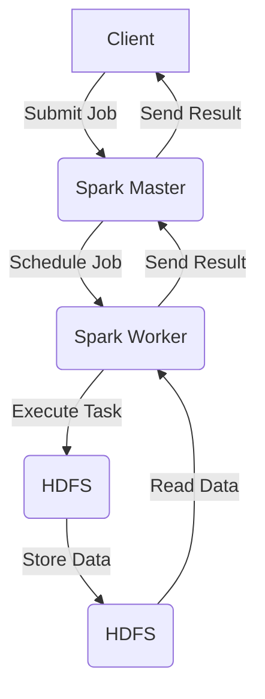
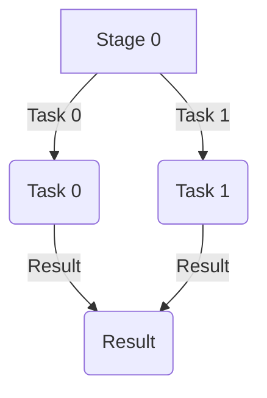

# Learning Plan

This plan is designed to help you learn Spark and Hadoop with deep analysis of Spark jobs. To analyze Spark jobs, we will use the Spark History Server and the Spark UI. The plan is divided into several sections, each focusing on a specific topic or task.

Topics:
1. **Introduction to Spark and Hadoop**
	 - Overview of Spark and Hadoop
	 - Understanding the architecture of Spark and Hadoop
2. **Reading Data with Spark**
	 - Reading data from HDFS
	 - Understanding the structure of data in Spark
3. **Partitioning and Parallelism**
	 - Understanding data partitioning in Spark
	 - How to optimize data processing with partitioning


## Introduction to Spark and Hadoop
Spark and Hadoop architecture, components, and how they work together.


## Stages of Spark Jobs

Simple Spark job with one stage and one task.
```scala
val df = spark.read.csv("hdfs://namenode:9000/data/openbeer/breweries/breweries.csv")
df.show()
df.select("_c1", "_c2").show()
```

What should I see in the Spark UI?



## Reading Data with Spark

## Partitioning and Parallelism

Example of partitioning data in Spark.
```scala
val df = spark.read.csv("hdfs://namenode:9000/data/openbeer/breweries/breweries.csv")
df.show()
df.repartition(4).show()
```